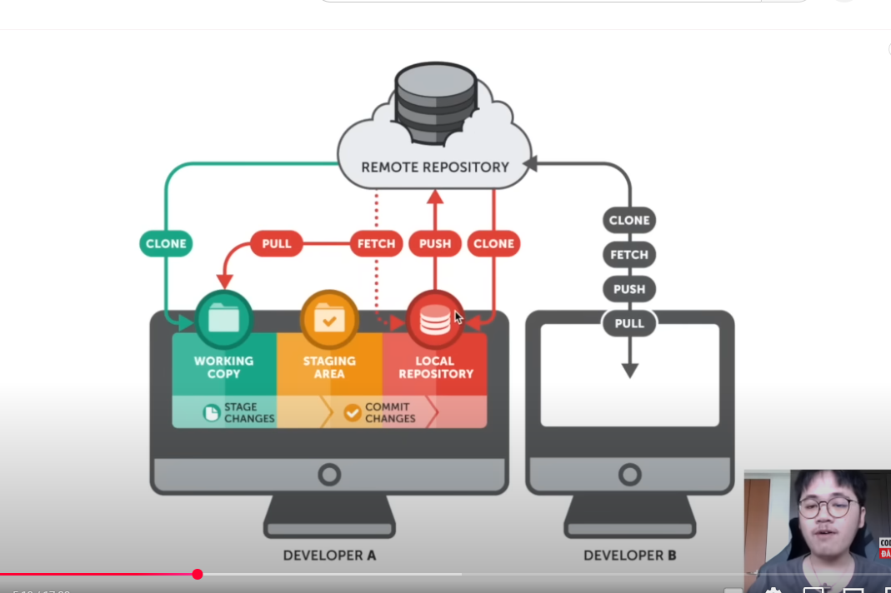

** File structure **

src/
└── app/                        # Thư mục chính của Next.js (App Router)
    ├── layout.jsx               # Layout chính cho toàn bộ ứng dụng
    ├── page.jsx                 # Trang Home ('/')
    ├── about/                   # Trang About ('/about')
    │   ├── page.jsx
    ├── recipe/                  # Trang Recipe ('/recipe')
    │   ├── page.jsx
    │   ├── [id]/                # Trang chi tiết món ăn ('/recipe/:id')
    │   │   ├── page.jsx  
    ├── components/              # Chứa các component dùng chung
    │   ├── Navbar.jsx           # Thanh điều hướng
    │   ├── Footer.jsx           # Footer của trang web
    │   ├── RecipeCard.jsx       # Card hiển thị món ăn
    │   ├── SearchBar.jsx        # Thanh tìm kiếm món ăn
    ├── context/                 # Chứa Context API để quản lý state toàn cục
    │   ├── RecipeContext.jsx    # Quản lý danh sách công thức nấu ăn
    │   ├── ThemeContext.jsx     # Quản lý theme (dark/light mode)
    ├── hooks/                   # Chứa các custom hooks
    │   ├── useDarkMode.jsx      # Hook bật/tắt dark mode
    │   ├── useFetchRecipes.jsx  # Hook lấy danh sách công thức từ API
    │   ├── useLocalStorage.jsx  # Hook lưu dữ liệu vào localStorage
    ├── lib/                     # Chứa các hàm xử lý logic
    │   ├── api/                 # Chứa các hàm gọi API
    │   │   ├── getRecipes.jsx   # Hàm lấy danh sách món ăn từ API
    │   │   ├── getRecipeById.jsx # Hàm lấy chi tiết món ăn từ API
    │   ├── utils/               # Chứa các hàm tiện ích
    │   │   ├── formatDate.jsx   # Định dạng ngày giờ
    │   │   ├── formatCurrency.jsx # Định dạng tiền tệ
    ├── styles/                  # Chứa file CSS/SCSS
    │   ├── globals.css          # CSS toàn cục
    │   ├── variables.css        # Các biến CSS dùng chung

** hướng dẫn git **

git add .                         #chon tất cả đẩy vào thư mục chung trong git
git commit -m "2 commit"          #comf để đẩy vào local 
git push                          #đây lên github
git pull                          #lấy từ github về máy

            #ảnh tổng quan cách hoạt động của git đẩy lên github